# 叶轮机械展示案例

本页面展示了叶轮机械领域的一些经典案例的网格划分和仿真计算结果。

## T106A

**案例介绍：** 

**数据源：**Peter Stadtmüller, Leonhard Fottner, Andreas Fiala, EXPERIMENTAL AND NUMERICAL 
INVESTIGATION OF WAKE-INDUCED TRANSITION ON A HIGHLY LOADED LP TURBINE AT LOW REYNOLDS NUMBERS, 
ASME Turbo Expo 2000: Power for Land, Sea, and Air, 10.1115/2000-GT-0269

**网格生成配置：** 计算使用的Case_T106A.json如下
```json
{
    "mesh": {
        "scale_factor":0.505,//坐标比例变换
        "cor_fac":1,//O型以外网格整体加粗倍数
        "refine_fac":1,//网格整体加密倍数
        "flip":[1,1,1],//坐标变换
        "limit":[10.0, 10.0, 400.0]//y+，z+，纵横比阈值
    },
    "mode": {
        "geometry":"blade",//叶片类型，blade或wing
        "nblock":12,//网格块数量
        "dimension": [false, true],//生成2D/3D网格
        "ext_block": [false,false],//生成上游/下游延长段网格
        "use_ext": false,//是否进行HUB网格边界分割
        "doe": false,//是否DOE批量生成网格
    },
    "gerl": {
        "pDlead":1.5,//入口到前缘距离系数（如1.5则延长距离为1.5*叶片弦长投影长度）
        "pDtrail":1.5,//出口到尾缘距离系数
        "file_swn_hub": " ",//hub边界曲线输入文件
        "file_swn_tip": " ",//shourd边界曲线输入文件
        "file_ps":"./input/T106A_ps.dat",//叶形压力面曲线参数输入文件
        "file_ss":"./input/T106A_ss.dat",//叶形吸力面曲线参数输入文件
        "nfile": 1,//参数曲线层数
        "tub_data": " ",
        "blade_name_stack": [ ],
        "blade_type_stack": [ ],
        "nblade": 1,//周向叶片数
        "pitch": 0.0799,//叶片周向间距 
        "span": 0.176,//叶片展向高度
    },
    "output": {
        "mesh_output": "T106A.cgns",//结果文件名
    }
}
```
**结果图：**
<figure>
    
    <figcaption>图1. T106A叶栅计算网格</figcaption>
</figure>

**网格信息及计算配置：**

|   参数   |         值         | 单位 |
|:------:|:-----------------:|:--:| 
|  网格总量  |      1294432      |    |
|   y+   | 10.0087930602391  |    |
|   z+   | 9.99999999999889  |    |
| 最大纵横比  | 387.341856031501  |    |
|  入口总温  |        300        | K  |
|  入口总压  |      24557.9      | Pa   |
|  出口静压  |      21994.4      |  Pa  |
| 入口金属角  |       45.5        |  °  |
| 入口湍流度  |         1         |   % |
|  CFL   |        20         |    |
| SU2求解器 |    RANS+SST+LM    |    |
|  数值格式  | ROE+SCALAR_UPWIND |    |

<figure>
    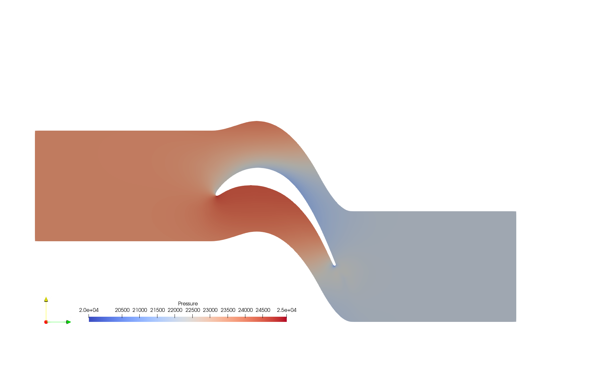
    <figcaption>图1. T106A 50%高度截面压力云图</figcaption>
</figure>
<figure>
    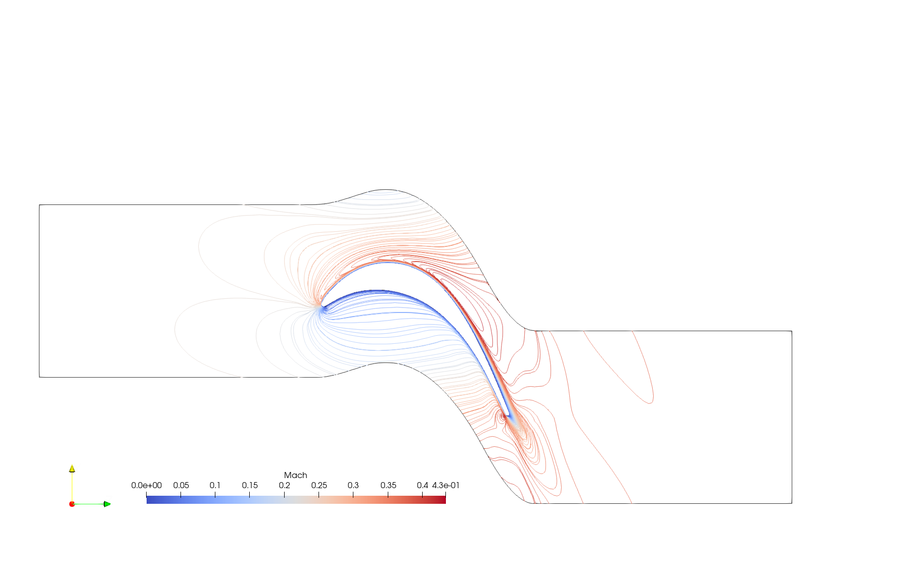
    <figcaption>图1. T106A 50%高度马赫数等值线图</figcaption>
</figure>
<figure>
    
    <figcaption>图1. T106A Q准则等值面图（马赫数染色）</figcaption>
</figure>
<figure>
    
    <figcaption>图1. T106A 50%高度叶形表面等熵马赫数曲线</figcaption>
</figure>

## T106C

**案例介绍：** 

**数据源：**Jan Michálek, Michelangelo Monaldi, Tony Arts, AERODYNAMIC PERFORMANCE OF A VERY HIGH LIFT LOW PRESSURE
TURBINE AIRFOIL (T106C) AT LOW REYNOLDS AND HIGH MACH NUMBER WITH
EFFECT OF FREE STREAM TURBULENCE INTENSITY, ASME Turbo Expo 2010: Power for Land, Sea and Air, 10.1115/GT2010-22884

**结果图：**
<figure>
    
    <figcaption>图1. T106C叶栅计算网格</figcaption>
</figure>

**网格信息及计算配置：**

|   参数   |         值         | 单位 |
|:------:|:-----------------:|:--:| 
|  网格总量  |       913000     |    |
|   y+   |  10.0184693827385 |    |
|   z+   | 9.99999999999889  |    |
| 最大纵横比  | 382.639363227617  |    |
|  入口总温  |        300       | K  |
|  入口总压  |      10884.18658     | Pa   |
|  出口静压  |     8193.935308      |  Pa  |
| 入口金属角  |         32.7     |  °  |
| 入口湍流度  |         0.9       |   % |
|  CFL   |        20      |    |
| SU2求解器 |    RANS+SST+LM    |    |
|  数值格式  | ROE+SCALAR_UPWIND |    |

<figure>
    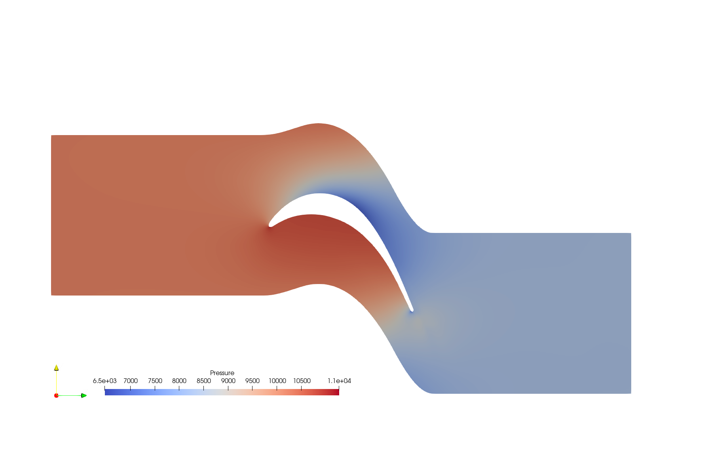
    <figcaption>图1. T106C 50%高度截面压力云图</figcaption>
</figure>
<figure>
    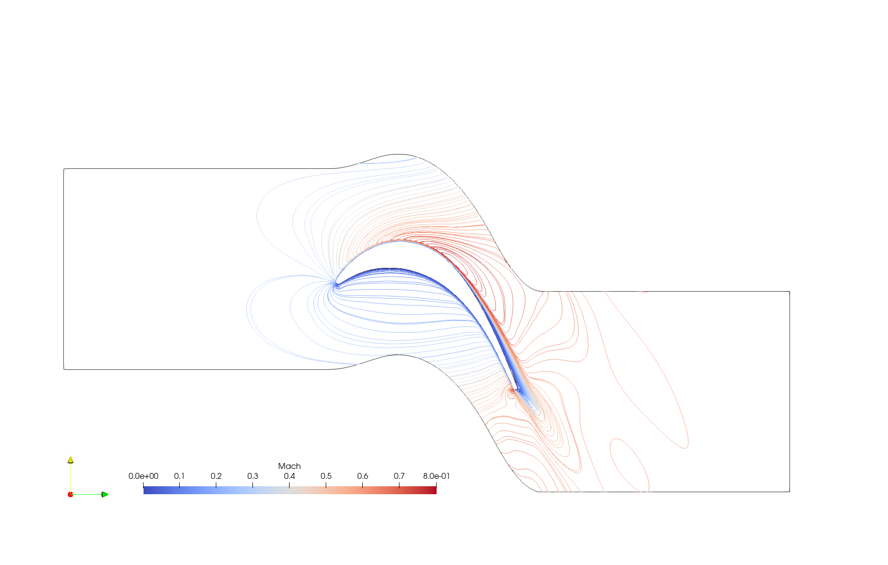
    <figcaption>图1. T106C 50%高度马赫数等值线图</figcaption>
</figure>
<figure>
    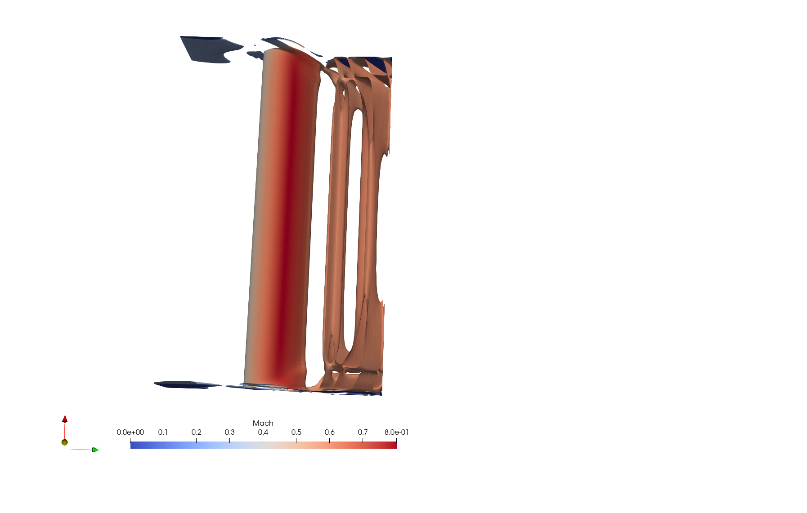
    <figcaption>图1. T106C Q准则等值面图（马赫数染色）</figcaption>
</figure>
<figure>
    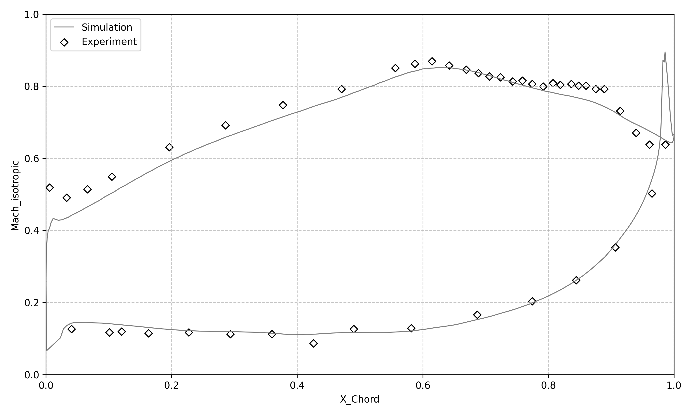
    <figcaption>图1. T106C 50%高度叶形表面等熵马赫数曲线</figcaption>
</figure>

## VKI LS89

**案例介绍：** 

**数据源：** T. Arts, M. Lambert de Rouvroit, A.W. Rutherford, AERO-THERMAL INVESTIGATION OF A
HIGHLY LOADED TRANSONIC LINEAR TURBINE GUlDE VANE CASCADE, van KARMAN INSTITUTE FOR FLUID DYNAMICS, Technical Note 174

**结果图：**
<figure>
    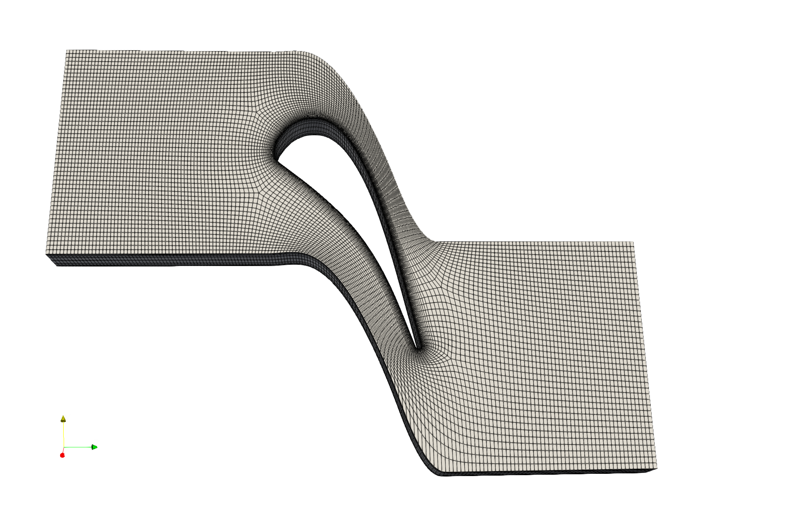
    <figcaption>图1. VKI叶栅计算网格</figcaption>
</figure>

**网格信息及计算配置：**

|   参数   |                值                 | 单位 |
|:------:|:--------------------------------:|:--:| 
|  网格总量  |              119940              |    |
|   y+   |         1.00611601979317         |    |
|   z+   |         19.9999999999977         |    |
| 最大纵横比  |         241.391616433135         |    |
|  入口总温  |               420                | K  |
|  入口总压  |   159600(MUR45)/147500(MUR47)    | Pa   |
|  出口静压  |    84300(MUR45)/88800(MUR47)     |  Pa  |
| 入口金属角  |                0                 |  °  |
| 入口湍流度  |                1                 |   % |
|  CFL   |                20                |    |
| SU2求解器 |           RANS+SST+LM            |    |
|  数值格式  |        ROE+SCALAR_UPWIND         |    |

<div style="display: flex; justify-content: center; align-items: center;">
    <figure style="margin: 0; flex: 1;">
        
        <figcaption>图1. 工况MUR45: VKI 50%高度截面压力云图</figcaption>
    </figure>
    <figure style="margin: 0; flex: 1;">
        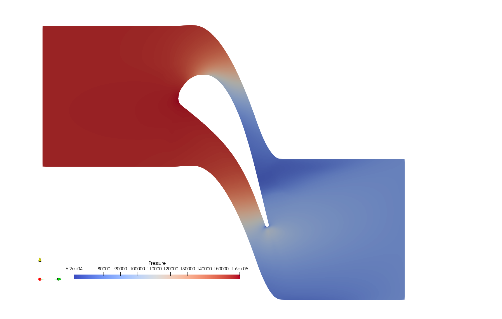
        <figcaption>图1. 工况MUR47: VKI 50%高度截面压力云图</figcaption>
    </figure>
</div>

<div style="display: flex; justify-content: space-between; align-items: center;">
    <figure style="margin: 1px; flex: 1;">
        
        <figcaption>图1. 工况MUR45: VKI 50%高度马赫数等值线图</figcaption>
    </figure>
    <figure style="margin: 1px; flex: 1;">
        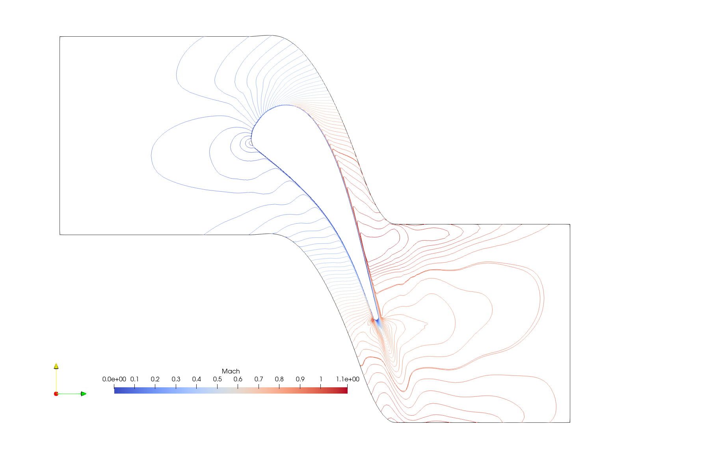
        <figcaption>图1. 工况MUR47: VKI 50%高度马赫数等值线图</figcaption>
    </figure>
</div>

<div style="display: flex; justify-content: space-between; align-items: center;">
    <figure style="margin: 1px; flex: 1;">
        
        <figcaption>图1. 工况MUR45: VKI Q准则等值面图（马赫数染色）</figcaption>
    </figure>
    <figure style="margin: 1px; flex: 1;">
        
        <figcaption>图1. 工况MUR47: VKI Q准则等值面图（马赫数染色）</figcaption>
    </figure>
</div>

<div style="display: flex; justify-content: space-between; align-items: center;">
    <figure style="margin: 1px; flex: 1;">
        
        <figcaption>图1. 工况MUR45: VKI 50%高度叶形表面等熵马赫数曲线</figcaption>
    </figure>
    <figure style="margin: 1px; flex: 1;">
        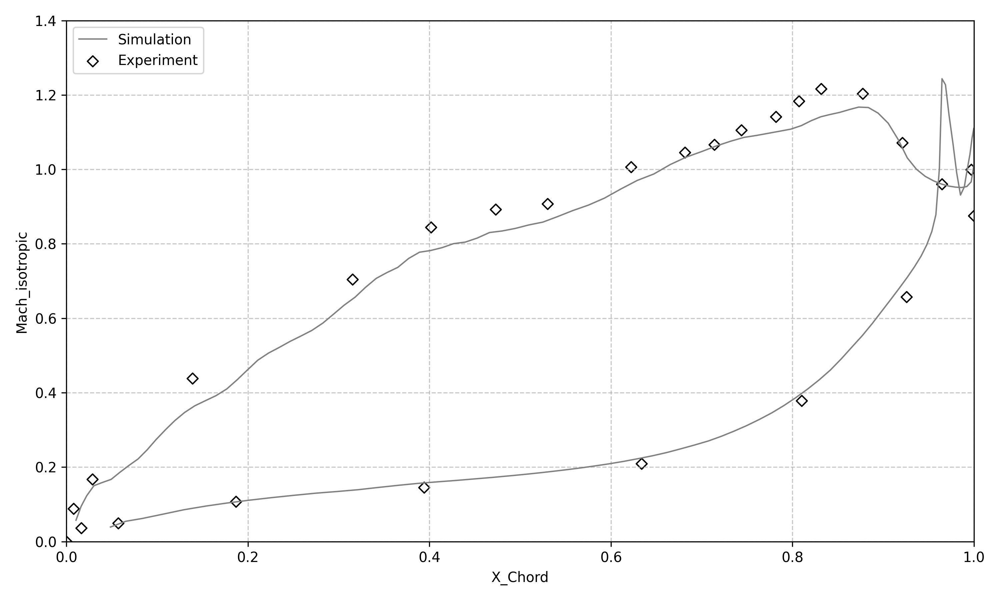
        <figcaption>图1. 工况MUR47: VKI 50%高度叶形表面等熵马赫数曲线</figcaption>
    </figure>
</div>

## Rotor37

**案例介绍：** 

**数据源：**Lonnie Reid and Royce D. Moore, Design and Overall Performance
of Four Highly Loaded, High-Speed Inlet Stages for an Advanced
High-Pressure-Ratio Core Compressor, NASA Technical Paper 1337

**结果图：**
<div style="display: flex; justify-content: space-between; align-items: center;">
    <figure style="margin: 1px; flex: 1;">
        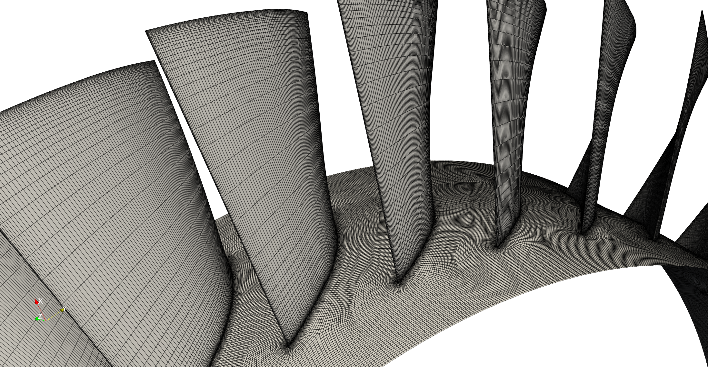
        <figcaption>图1. Rotor37计算网格局部放大 </figcaption>
    </figure>
    <figure style="margin: 1px; flex: 1;">
        
        <figcaption>图1. Rotor37计算网格 </figcaption>
    </figure>
</div>

**网格信息及计算配置：**

|   参数   |         值         |  单位   |
|:------:|:-----------------:|:-----:| 
|  网格总量  |      770936       |       |
|   y+   | 1.00844738006129  |       |
|   z+   | 4.99327435342922  |       |
| 最大纵横比  |  700.34963609152  |       |
|  入口总温  |        300        |   K   |
|  入口总压  |      101325       |  Pa   |
|  出口静压  |       95000       |  Pa   |
|   转速   | (0,0,-1799.8519)  | rad/s |
|  CFL   |        10         |       |
| SU2求解器 |    RANS+SST+LM    |       |
|  数值格式  | ROE+SCALAR_UPWIND |       |

<figure>
    
    <figcaption>图1. Rotor37 50%高度截面压力云图</figcaption>
</figure>
<figure>
    
    <figcaption>图1. Rotor37 50%高度马赫数等值线图</figcaption>
</figure>
<figure>
    
    <figcaption>图1. Rotor37 Q准则等值面图（马赫数染色）</figcaption>
</figure>

## Rotor67

**案例介绍：** 

**数据源：**M. J. Pierzga, J.R.Wood, Investigation of the Three-
Dimensional Flow Field Within a Transonic Fan Rotor: Experiment and Analysis, NASA Technical Memorandum 83739

**结果图：**
<div style="display: flex; justify-content: space-between; align-items: center;">
    <figure style="margin: 1px; flex: 1;">
        
        <figcaption>图1. Rotor67计算网格局部放大 </figcaption>
    </figure>
    <figure style="margin: 1px; flex: 1;">
        
        <figcaption>图1. Rotor67计算网格 </figcaption>
    </figure>
</div>

**网格信息及计算配置：**

|   参数   |         值         | 单位 |
|:------:|:-----------------:|:--:| 
|  网格总量  |        1331820           |    |
|   y+   |           1.09007595597836        |    |
|   z+   |            4.99555602943846       |    |
| 最大纵横比  |        867.23700720102           |    |
|  入口总温  |        300        | K  |
|  入口总压  |                   | Pa   |
|  出口静压  |                   |  Pa  |
|   转速   |  (0,0,-1679.98)   | rad/s |
|  CFL   |        10         |    |
| SU2求解器 |    RANS+SST+LM    |    |
|  数值格式  | ROE+SCALAR_UPWIND |    |

<figure>
    
    <figcaption>图1. Rotor67 50%高度截面压力云图</figcaption>
</figure>
<figure>
    
    <figcaption>图1. Rotor67 50%高度马赫数等值线图</figcaption>
</figure>
<figure>
    
    <figcaption>图1. Rotor67 Q准则等值面图（马赫数染色）</figcaption>
</figure>

## NACA0015

**案例介绍：**

**网格展示：**
<figure>
    
    <figcaption>图1. NACA0015翼型计算网格</figcaption>
</figure>

**网格信息及计算配置：**

|   参数   |         值         | 单位 |
|:------:|:-----------------:|:--:| 
|  网格总量  |      137160      |    |
|   y+   |  5.37726708344126 |    |
|   z+   | 4999.99999999998 |    |
| 最大纵横比  |  3715.02301450229 |    |

## N4412

**案例介绍：**

**网格展示：**
<figure>
    
    <figcaption>图1. N4412翼型计算网格</figcaption>
</figure>

**网格信息及计算配置：**

|   参数   |         值         | 单位 |
|:------:|:-----------------:|:--:| 
|  网格总量  |      211608      |    |
|   y+   | 1.00000000000228  |    |
|   z+   | 499.999999999989 |    |
| 最大纵横比  | 3598.23560215619  |    |


